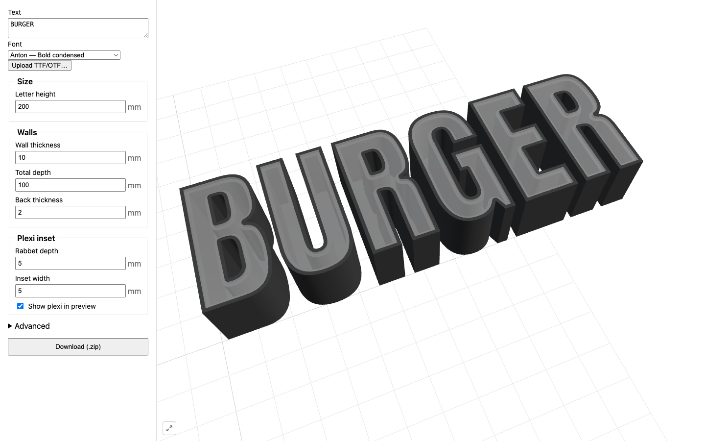

# Lightbox Letter Generator

A browser-based generator for **3D-printable lightbox letter shells with a frosted-acrylic plexi inset**. Type a word, pick a font, dial in the dimensions, and download STLs ready to print plus the matching plexi cut shapes ready to laser-cut.

**🔗 Live: <https://framegrabber.github.io/lightbox-letter-generator/>**



Runs entirely in the browser. No server, no account, all geometry computed client-side via WebAssembly.

## What you download

A single zip per export:

```
lightbox-<timestamp>.zip
├── README.txt          # parameters used + a URL that reproduces this exact export
├── stl/
│   ├── 01_<letter>.stl   # 3D shell — back floor, side walls, stepped rabbet on top
│   ├── 02_<letter>.stl
│   └── …
└── plexi/
    ├── 01_<letter>.svg   # plexi cut shape; drops into the rabbet flush with the front
    ├── 02_<letter>.svg
    └── …
```

Numeric prefixes preserve word order; spaces are skipped. Each STL is centered on its outer-contour bounding box (back face at `Z=0`), oriented Z-up, units mm.

## How a letter is built

Per glyph: extrude the outer contour to `totalDepth`, hollow out the interior with a `wallThickness` offset (leaving a closed back floor of `backThickness`), and carve a rabbet on the front face whose shelf width equals `insetWidth`. The plexi piece is the rabbet cutout shape extruded by `rabbetDepth` — it sits in the recess flush with the front of the letter.

## Tech

- **Vite + React + TypeScript** (strict mode)
- **manifold-3d** (WASM CSG) for 2D offsets, extrusion, and boolean operations
- **opentype.js** for font parsing, glyph contours, advance widths, kerning
- **three.js + @react-three/fiber** for the 3D preview (Z-up, frosted plexi via `MeshPhysicalMaterial`)
- **zustand** for the parameter store; URL + localStorage round-trip persistence
- Geometry runs in a **Web Worker** so the UI stays responsive
- Deployed to **GitHub Pages** via Actions

## Develop

```bash
npm install
npm run dev      # http://localhost:5173
npm run build    # static dist/ for any host
```

## Tests

```bash
npm test         # 42 unit tests (Vitest)
npm run e2e      # Playwright smoke test for the full type→download flow
```

## Bundled fonts

Inter, Montserrat, Anton (default), Bebas Neue, Bungee, Roboto Slab, Playfair Display, Pacifico — all SIL OFL or Apache 2.0. Upload your own TTF/OTF in the Font picker for anything else.

## License

MIT for the code; bundled fonts retain their own licenses (see `public/fonts/`).
